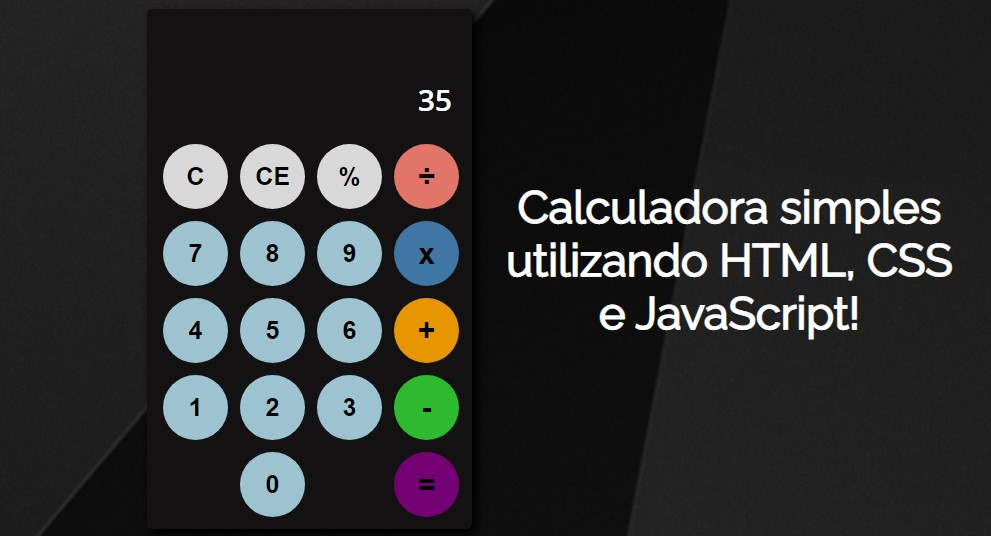

<h1 align="center">
    <a href="#">Calculadora</a>
</h1>

Calculadora simples utilizando recursos do HTML5, CSS3 e JavaScript

<h1 align="center">
  
</h1>

Tabela de conteúdos
=================

 <a href="#objetivo">Objetivo</a> •
 <a href="#tecnologias">Tecnologias</a> • 
 <a href="#contribuicao">Contribuição</a> • 
 <a href="#licenc-a">Licença</a> • 
 <a href="#autor">Autor</a>

